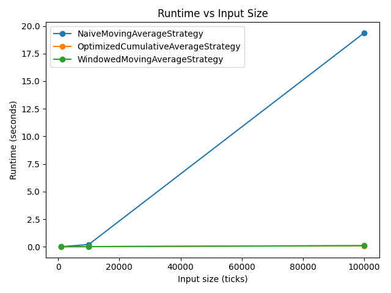
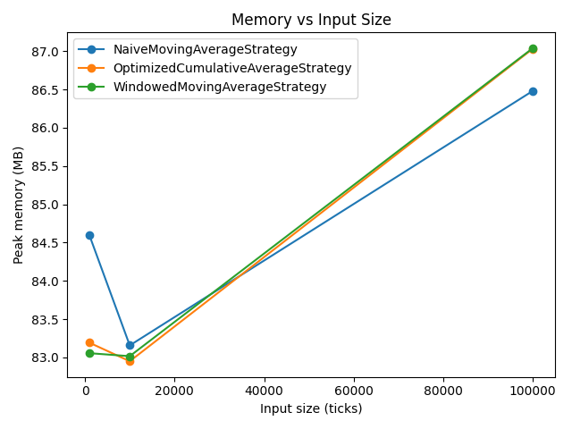

# Runtime & Space Complexity in Financial Signal Processing

## Overview
This project ingests market ticks from a CSV file and compares multiple moving-average trading strategies using:
- Theoretical Big-O analysis
- Empirical profiling (timeit, cProfile, memory_profiler)
- Scaling plots

## Complexity Annotations (Big-O)
- **NaiveMovingAverageStrategy**: Per-tick time O(n), total O(N^2); space O(N) (stores full history).
- **OptimizedCumulativeAverageStrategy**: Per-tick time O(1), total O(N); space O(1) (running sum + count).
- **WindowedMovingAverageStrategy**: Per-tick time O(1) amortized, total O(N); space O(k) (deque window).

## Benchmark Results
| Strategy | Ticks | Runtime (s) | Peak Memory (MB) |
|---|---:|---:|---:|
| NaiveMovingAverageStrategy | 1,000 | 0.002931 | 84.59 |
| NaiveMovingAverageStrategy | 10,000 | 0.203727 | 83.16 |
| NaiveMovingAverageStrategy | 100,000 | 19.374611 | 86.48 |
| OptimizedCumulativeAverageStrategy | 1,000 | 0.000929 | 83.19 |
| OptimizedCumulativeAverageStrategy | 10,000 | 0.009177 | 82.95 |
| OptimizedCumulativeAverageStrategy | 100,000 | 0.093949 | 87.03 |
| WindowedMovingAverageStrategy | 1,000 | 0.001001 | 83.05 |
| WindowedMovingAverageStrategy | 10,000 | 0.010080 | 83.02 |
| WindowedMovingAverageStrategy | 100,000 | 0.101545 | 87.04 |

## Plots
### Runtime vs Input Size

### Memory vs Input Size

## Narrative Comparison
For **100,000 ticks**, fastest → slowest (by runtime):
- OptimizedCumulativeAverageStrategy: 0.093949s, peak 87.03MB
- WindowedMovingAverageStrategy: 0.101545s, peak 87.04MB
- NaiveMovingAverageStrategy: 19.374611s, peak 86.48MB

The naive strategy recomputes a sum over the entire history every tick (quadratic total work), so it should scale much worse than the O(N) strategies as N grows.
The optimized cumulative-average refactor reduces both time and space by tracking only a running sum and count (no full history list required). The windowed strategy bounds memory to O(k) by keeping only the last k prices.

## Notes on Measurement
- **Runtime** uses `timeit.repeat(..., number=1)` and reports the best of a few repeats to reduce noise.
- **Peak memory** uses `memory_profiler` when installed; otherwise falls back to `tracemalloc` (Python allocation peak).
- `cProfile` outputs are saved under the `profiles/` directory.
